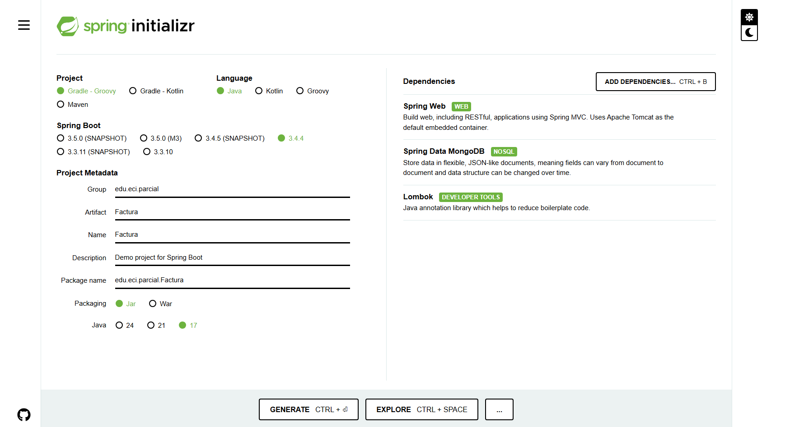
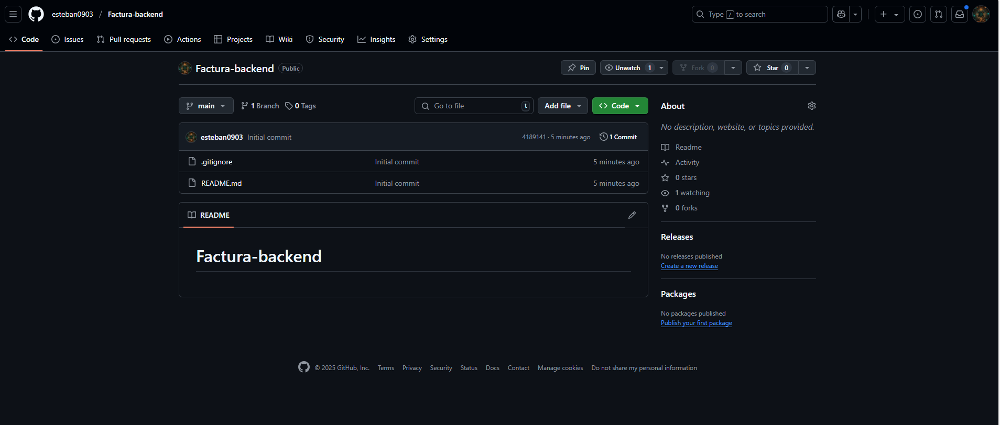

# Creamos el scaffolding del proyecto con las dependencias:
##  Spring web , mongo db y lombook (reducir getters setters, data)

# A su vez creamos el repositorio para subir el backend

# Creamos las carpetas controller, model, service, config, repository

